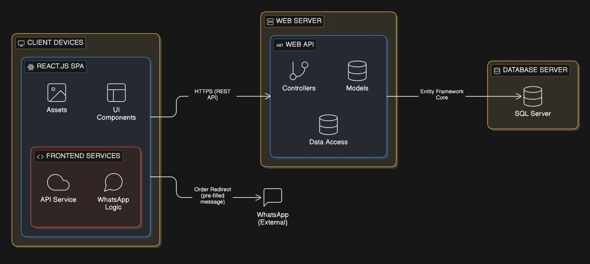
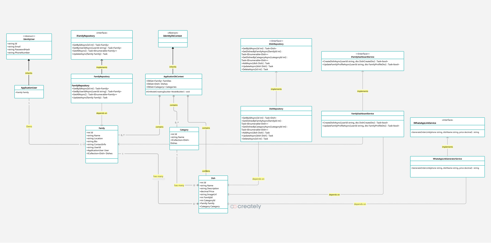
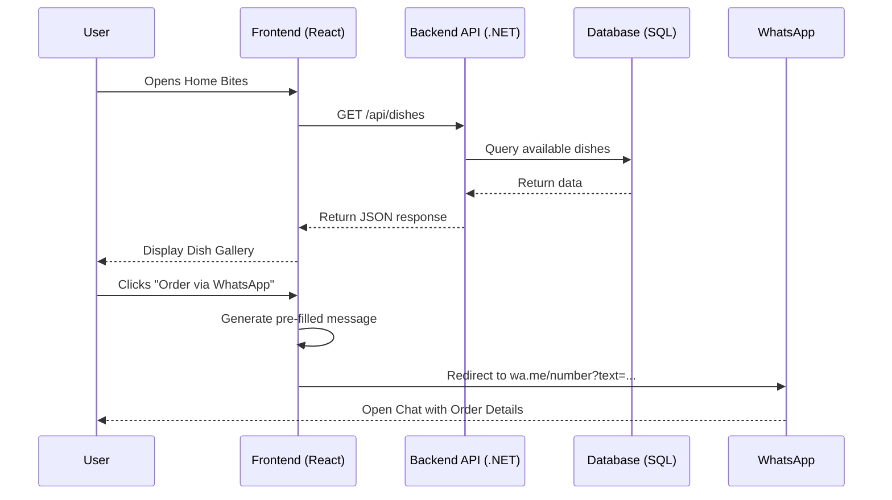
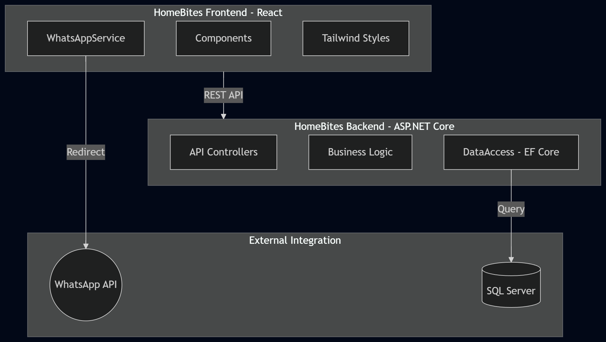
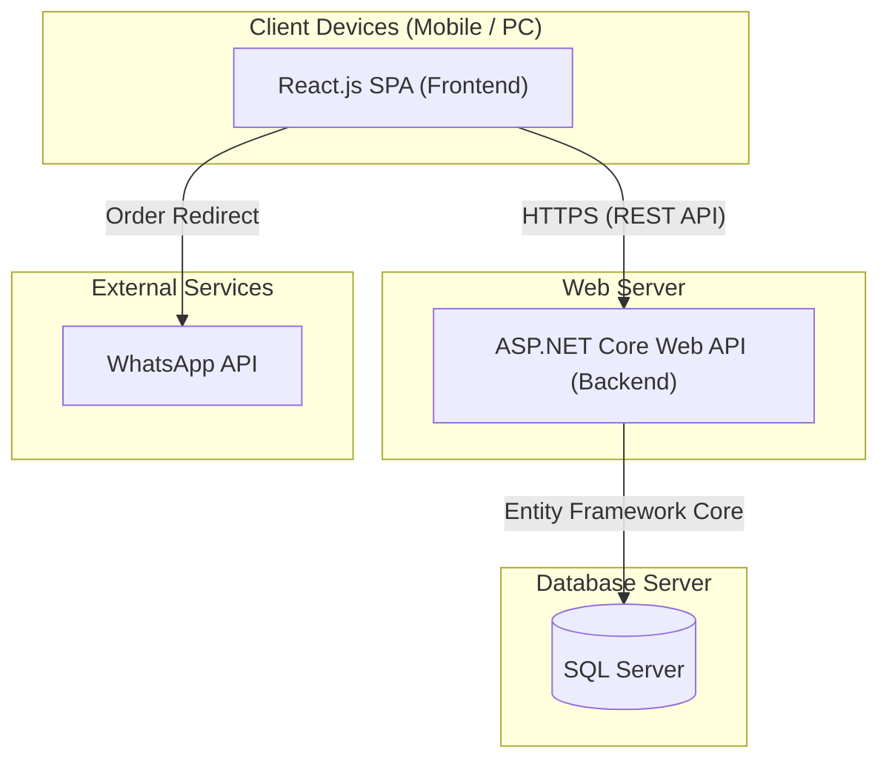
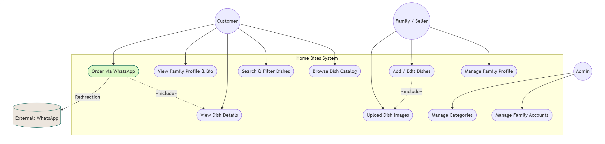

# Home Bites Project Architecture

## Change History

| Date       | Version | Description                                                 | Author           |
| :--------- | :------ | :---------------------------------------------------------- | :--------------- |
| 2026-03-30 | 1.0     | Initial architectural framework                             | Ali Anaam        |
| 2026-04-05 | 1.1     | Added Process Architecture, Size & Performance, and Quality | Ali Anaam        |
| 2026-04-08 | 1.2     | Added Physical Architecture and Quality Attributes          | Yousef Alreyashi |

## Table of Contents

1. [Scope](#1-scope)
2. [References](#2-references)
3. [Software Architecture](#3-software-architecture)
4. [Architectural Goals & Constraints](#4-architectural-goals--constraints)
5. [Logical Architecture](#5-logical-architecture)
6. [Process Architecture](#6-process-architecture)
7. [Development Architecture](#7-development-architecture)
8. [Physical Architecture](#8-physical-architecture)
9. [Scenarios](#9-scenarios)
10. [Size and Performance](#10-size-and-performance)
11. [Quality](#11-quality)
12. [Appendices](#appendices)

## List of Figures

- [Figure 1: Software Architecture Diagram](#figure-1)
- [Figure 2: High-Level Logical Component Diagram](#figure-2)
- [Figure 3: Order Process Sequence Diagram](#figure-3)
- [Figure 4: Development View Diagram](#figure-4)
- [Figure 5: Deployment Diagram](#figure-5)
- [Figure 6: Use Case Diagram](#figure-6)

---

## 1. Scope

The primary objective of **Home Bites** is to bridge the gap between home-based culinary entrepreneurs and local customers through a streamlined digital storefront.

### 1.1 In-Scope (What the System Will Do)

The platform functions as a **discovery and cataloging engine**. It is designed to handle the following:

- **Digital Presence for Families:** Provides a structured landing page for each business, including their story (bio), location, and contact details.
- **Visual Product Catalog:** Supports the uploading and display of high-quality dish images, detailed descriptions, and transparent pricing.
- **Discovery Tools:** A searchable database allowing customers to find specific dishes or families, complemented by category filters (e.g., Traditional, Desserts, Healthy).
- **Communication Bridge:** A dedicated **"Order via WhatsApp"** integration that triggers a pre-filled message—including the dish name and price—to streamline the transition from browsing to buying.
- **Cross-Platform Accessibility:** A responsive web design ensuring the catalog is easily navigable on both mobile devices and desktops.

### 1.2 Out-of-Scope (Boundaries & Limitations)

To maintain simplicity and reduce operational overhead for the families, the following features are **not** part of the Home Bites system:

- **In-App Payment Processing:** The system will not handle credit card transactions or digital wallets. All financial exchanges occur externally between the customer and the family.
- **Order Management System (OMS):** There is no internal dashboard to track order status (e.g., "Pending," "Cooking," "Delivered").
- **Logistics and Delivery:** The platform does not provide delivery tracking or integration with third-party courier services.
- **Direct Messaging:** There is no internal chat system; all communication is redirected to WhatsApp.
- **Inventory Management:** The system will not automatically "hide" items when they are out of stock; manual updates by the family are required.

## 2. References

- Kruchten’s 4+1 Model: Architectural framework used for this document. [4+1 architectural view model](https://en.wikipedia.org/wiki/4%2B1_architectural_view_model).

## 3. Software Architecture

<a name="figure-1"></a>

### Figure 1: Software Architecture Diagram



## 4. Architectural Goals & Constraints

### 4.1 Architectural Goals

- Usability & Accessibility: The system must be intuitive for users with varying technical skills (both customers and families) and fully responsive on mobile devices.
- Reliability: The transition from the catalog to WhatsApp must be seamless and 100% functional to ensure no orders are lost.
- Performance: The application should handle up to 30 concurrent users with an API response time of less than 2 seconds.
- Maintainability: The use of Layered Architecture and Repository Pattern ensures that adding new features (like a payment gateway later) is straightforward.

### 4.2 Architectural Constraints

- Technology Stack: The backend must be built using ASP.NET Core 10.0 and the frontend using React.js, as per project requirements.
- External Integration: Ordering must be delegated to the WhatsApp API rather than an internal messaging system.
- Data Persistence: Must use SQL Server with Entity Framework Core for data management.
- No Internal Payments: The architecture must stay within the "discovery-only" scope, meaning no sensitive financial data is stored or processed.

*

## 5. Logical Architecture

This section details the domain entities, their relationships, and the architectural layers of the Home Bites platform.

<a name="figure-2"></a>

### Figure 2: High-Level Logical Component Diagram



## 6. Process Architecture

This part describes the system workflow and interactions between components during runtime.

<a name="figure-3"></a>

### Figure 3: Order Process Sequence Diagram



### 6.1 Process Explanation

1. **Access:** The user opens the Home Bites platform.
2. **Request:** The frontend sends a request to the backend API to retrieve available dishes.
3. **Fetch:** The backend communicates with the database to fetch the required data.
4. **Display:** The data is returned to the frontend and displayed to the user.
5. **Selection:** The user selects a dish and clicks on "Order via WhatsApp".
6. **Generation:** The system generates a pre-filled message containing dish details.
7. **Redirection:** The user is redirected to WhatsApp to complete the order externally.

## 7. Development Architecture

Details regarding the code structure, libraries, and development environment.

### 7.1 Package Decomposition

<a name="figure-4"></a>

### Figure 4: Development View Diagram



The Home Bites system is organized into two main development environments to ensure a clear separation of concerns:

- Frontend : A React.js application organized by functionality (Components, Services for API calls, and Assets).
- Backend :An ASP.NET Core Web API structured using the Layered Architecture pattern, including Controllers, Models, and Data Access layers.

### 7.2 Module Dependencies

- UI Framework:Tailwind CSS for rapid responsive design.
- Data Access: Entity Framework Core (Code First) to manage database interactions.
- Communication: Axios/Fetch for connecting React components to backend RESTful endpoints.
- External Integration: WhatsApp Dynamic URI Linker to facilitate external order handling.

### 7.3 Folder Structure

```text
HomeBites/
├── client/ (Frontend)
│   ├── src/components/
│   ├── src/services/ (WhatsApp logic)
├── server/ (Backend)
│   ├── Controllers/
│   ├── Models/
│   ├── Data/
└── docs/ (Architecture Diagrams)
```

## 8. Physical Architecture

This section defines the deployment architecture and physical nodes for the Home Bites platform.

<a name="figure-5"></a> 

### Figure 5: Deployment Diagram



### 8.1 System Nodes

1. **Client Device (Frontend):** Runs the React.js Single Page Application (SPA) on modern web browsers.

2. **Web Server (Backend):** Hosts the ASP.NET Core Web API to handle business logic.

3. **Database Server (Data Tier):** SQL Server managed via Entity Framework Core to store relational data.

4. **External Integrations:** WhatsApp API for external order delegation.

## 9. Scenarios

This section describes the "plus one" (+1) view of the architecture, representing key use cases that validate the design. These stories demonstrate how the Logical, Process, and Physical architectures work together to fulfill user needs.

<a name="figure-6"></a>

### Figure 6: Use Case Diagram



### 9.1 Scenario 1: Exploring Local Flavors (Browsing & Discovery)

**Actor:** Customer  
**Goal:** To find and view available homemade food options nearby.

- **The Story:** Sarah is looking for authentic traditional food for dinner. She opens the **Home Bites** web app on her smartphone.
- **System Action:** The **React Frontend** sends an asynchronous `GET` request to the **ASP.NET Core API**.
- **Architectural Interaction:** The API queries the **SQL Database** via Entity Framework Core to fetch the list of active family businesses and their featured dishes.
- **Result:** Within 2 seconds, Sarah sees a visually rich gallery of dishes. She uses the **Category Filter** to select "Traditional," and the UI instantly updates to show relevant items like Kabsa and Mandi, pulling optimized image URLs from the cloud storage.

---

### 9.2 Scenario 2: Placing an Order (The WhatsApp Bridge)

**Actor:** Customer  
**Goal:** To initiate a purchase for a specific dish.

- **The Story:** Sarah decides on a "Family Size Kunafa" from a local baker named "Aisha’s Sweets." She clicks the **"Order via WhatsApp"** button.
- **System Action:** The **Frontend Service** captures the dish name ($Kunafa$), price ($50$ $SAR$), and the family’s registered WhatsApp number. It dynamically generates a URI-encoded link: `https://wa.me/966.../?text=Hello! I would like to order the Family Size Kunafa...`.
- **Architectural Interaction:** Instead of processing a payment internally (which is Out-of-Scope), the architecture triggers a **External Service Redirect**.
- **Result:** Sarah’s WhatsApp app opens automatically with a pre-filled message. She hits "Send," and the transaction continues as a direct conversation between her and the business owner.

---

### 9.3 Scenario 3: Finding a Specific Business (Search Functionality)

**Actor:** Customer  
**Goal:** To locate a specific family business they have heard about.

- **The Story:** A friend told Ahmed about "Healthy Bites by Mariam." Ahmed types "Mariam" into the search bar on the Home Bites homepage.
- **System Action:** The search triggers a request to the **Backend Controller**.
- **Architectural Interaction:** The backend executes a filtered query against the **Family Profile** table in the database.
- **Result:** The system returns Mariam’s profile page, displaying her bio, location, and her entire digital food catalog, allowing Ahmed to browse her specific offerings.

---

### 9.4 Scenario 4: Handling Service Disruptions (Error Handling)

**Actor:** Customer / System
**Goal:** To maintain a graceful user experience during a database timeout.

- **The Story:** Due to a temporary network flicker, the API cannot reach the SQL Database while a user is loading the page.
- **System Action:** The **Backend Error Handler** catches the exception and returns a `500 Internal Server Error` status code.
- **Architectural Interaction:** The **React Frontend** receives the error code instead of the expected JSON.
- **Result:** Instead of a broken page or a "white screen of death," the UI displays a user-friendly message: _"Failed to load data. Please check your connection and try again,"_ along with a **Retry** button, as defined in the Quality Attributes (Section 11).

## 10. Size and Performance

This system is designed for a small number of users, focusing on simplicity and efficiency.

### 10.1 Data Size Estimation

- **Families:** 50 – 100 records
- **Dishes:** 200 – 500 records
- **Categories:** 5 – 20 records
- **Images:** Stored as external URLs (optimized for fast loading)

### 10.2 Performance Requirements

- **API Response Time:** < 2 seconds
- **Page Load Time:** < 3 seconds
- **Concurrent Users:** Supports up to 30 users

### 10.3 Optimization Techniques

- Basic query optimization using **Entity Framework Core**.
- Simple pagination to limit data transfer.
- Use of asynchronous API calls to prevent blocking.

## 11. Quality

### 11.1 Quality Attributes

- **Usability:** The system applies the KISS (Keep It Simple, Stupid) principle. Customers can browse the catalog and reach the WhatsApp order button quickly without complex navigation.
- **Responsiveness:** The UI is built using Tailwind CSS, ensuring it is fully optimized and accessible for both mobile and desktop users.
- **Performance:** The ASP.NET Core backend uses the Repository Pattern with Entity Framework Core to make database queries fast and efficient.
- **Reliability:** By delegating the ordering process to the WhatsApp API, the system minimizes internal transaction failures.

### 11.2 Testing Strategy

- **UI/UX Testing:** Manual testing across different screen sizes.
- **Integration Testing:** Verifying dynamic WhatsApp URI generation.
- **API Testing:** Validating ASP.NET Core endpoints for correct JSON responses.

### 11.3 Error Handling

The system uses simple error handling to ensure a smooth user experience for a small number of users.

#### 11.3.1 Frontend Error Handling

- Display simple and clear messages:
    - "Failed to load data"
    - "Something went wrong"
- Allow the user to retry the request
- Basic input validation before sending requests

---

#### 11.3.2 Backend Error Handling

- Use try-catch blocks to handle errors
- Return simple HTTP status codes:

| Code | Description           |
| ---- | --------------------- |
| 200  | Success               |
| 400  | Bad Request           |
| 404  | Not Found             |
| 500  | Internal Server Error |

---

#### 11.3.3 Common Error Scenarios

- Server or database connection failure → 500 error
- Requested dish not found → 404 error
- Invalid user input → 400 error

---

#### 11.3.4 Logging

- Basic error logging for debugging purposes

### 11.4 Security Considerations

Since the system redirects users to WhatsApp for order communication, it does not handle or store sensitive data such as payment information.

This design reduces security risks because:

- No payment or financial data is processed within the system
- No sensitive user information is stored in the database
- Communication is handled through WhatsApp, which provides its own security mechanisms

Overall, the system minimizes security vulnerabilities by keeping transactions external and maintaining a simple data structure.

---

## Appendices

### Design Principles & Architectural Patterns

The Home Bites backend prioritizes maintainability and scalability through the following architectural patterns:

Layered Architecture (Separation of Concerns)
System logic is divided to prevent cascading failures:

Domain Layer: Contains core business entities (Family, Dish, Category) and Identity models.

Data Access Layer: Uses EF Core to manage the database, isolating SQL logic.

API/Presentation Layer: ASP.NET Controllers handle HTTP requests and delegate heavy lifting to services.

The Repository Pattern
Controllers interact with abstraction interfaces (IFamilyRepository, IDishRepository) instead of querying the database directly. This centralizes data access and makes unit testing much easier.

Dependency Injection (DI)
Services and repositories are injected into controllers at runtime using ASP.NET Core's built-in DI, preventing tight coupling between classes.

SOLID Principles

SRP (Single Responsibility): Classes have one strict job (e.g., WhatsAppLinkGeneratorService only formats links; it doesn't touch the database).

DIP (Dependency Inversion): Controllers depend on abstractions (interfaces) rather than concrete implementations, allowing us to swap out logic easily.

Security & Identity Abstraction
Using ASP.NET Core Identity provides secure, industry-standard password hashing and token validation, linking a family's dashboard access (FamilyId) directly to an ApplicationUser.

Acronyms and Definitions
API: Protocols allowing the React frontend to communicate with the ASP.NET Core backend.

CORS: A security feature allowing the frontend to safely make HTTP requests to the backend across different domains.

DI (Dependency Injection): Providing objects to a class rather than the class creating them directly, promoting loose coupling.

EF Core: The Object-Relational Mapper (ORM) bridging C# models with the SQL Server database (Code-First approach).

Identity (ASP.NET Core Identity): The built-in framework managing secure user authentication and authorization.

Repository Pattern: Abstracting database operations behind interfaces to separate data access from business logic.

SOLID: Five object-oriented design principles intended to make software flexible and maintainable.

SPA (Single Page Application): A web app (React.js) that dynamically updates the current page without reloading, resulting in a faster user experience.

UML: A standard modeling language used to visualize software architecture.
